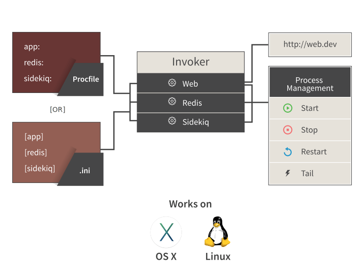

## What is Invoker?
Invoker is a utility belt for managing processes in development environment.
Use it for managing multiple processes with ease.

Use it for developing web applications on different local domains without
`/etc/hosts` hacks.

## How to use it?

First we need to install invoker gem to get command line utility called invoker, we can do that via:


~> gem install invoker


Currently it only works with Ruby >= 1.9.3.

You need to start by creating a `ini` file which will define processes you want to manage using invoker. An example `ini` file is included in the repo.


[rails]
directory = /home/gnufied/god_particle
command = bundle exec rails s -p 5000

[dj]
directory = /home/gnufied/god_particle
command = bundle exec ruby script/delayed_job

[events]
directory = /home/gnufied/god_particle
command = bundle exec ruby script/event_server


After that you can start process manager via:


~> invoker start invoker.ini


Above command will start all your processes in one terminal with their stdout/stderr merged and labelled. You
can also start `Invoker` by daeomonizing it, via:


~> invoker start invoker.ini -d


## .dev TLD support for OSX and Linux.

You can access http services managed by invoker via `command_label.dev` domain locally.

To make it work though, you need to run following command, just once from anywhere:


~> sudo invoker setup # read below if you are migrating from Pow


This feature has been well tested to work on both `OSX` and `Linux`.

If you decide to remove Invoker, you can remove things installed by Invoker using command


~> sudo invoker uninstall


Now because invoker is making your app server available on a domain. It requires
control over port(or needs to know the port) on which your applications will be listening. This can be simply done by replacing specific port number in `ini` file with `$PORT` or by specifying
a port key. For example:


[terminal]
directory = /home/gnufied/ayr-terminal
port = 3000
command = node app

[cms]
directory = /home/gnufied/mezzainine
command = python manage.py runserver $PORT --noreload

[typo]
directory = /home/gnufied/typo
command = bundle exec rails s -p $PORT


Now these services can be accessed via `http://terminal.dev` , `http://cms.dev`
`http://typo.dev`. You can also access them via wildcard subdomains such as `*.*.dev`.

You can also access any external http process via `.dev` DNS by running
following command:


~> invoker add_http wordpress 8080


Above command will make wordpress available on `wordpress.dev` even if
wordpress was original not started by Invoker. You can access any randomly
started process via Invoker like this.

## Https support

Invoker uses a self-signed certificate to make all your web applications available via
`https` as well. You absolutely don't have to do anything. Access your webapps on `https://app.dev`
and enjoy!

## Procfile support

Invoker is 100% compatbile with `Procfile` format used by Heroku. If you
have been using a `Procfile` to bootstrap your development stack, you can
keep using it with `Invoker.`

The only thing to remember is, your `Procfile`
must have `$PORT` in command - for `.dev` domain feature to work


rails: cd $HOME/rails_app && bundle exec rails s -p $PORT
cms: cd $HOME/cms && python manage.py runserver $PORT


## Process managment

Additionally Invoker allows you to manage individual processes. You can start/stop/restart
different processes managed by invoker without affecting others. Following commands work
for processes started by `Procfile` as well.


# Will try to stop running delayed job by sending SIGINT to the process
~> invoker remove dj

# If Process can't be killed by SIGINT send a custom signal
~> invoker remove dj -s 9

# add and start running
~> invoker add dj

# List currently running processes managed by invoker
~> invoker list

# Restart process given by command Label
~> invoker reload dj

# Restart process given by command label using specific signal for killing
~> invoker reload dj -s 9

# tail logs of specified process. This is specially useful if you started
# invoker daemonized or you want to watch logs of just one process discarding
# others.
~> invoker tail dj



You can also enable OSX notifications for crashed processes by installing terminal-notifier gem. It is not a
dependency, but can be useful if something crashed and you weren't paying attention.

## Migrating from Pow

If you are migrating from Pow then first step before running `invoker setup` is to uninstall Pow:


curl get.pow.cx/uninstall.sh | sh


After that you should run `invoker setup`
as usual. If for some reason you can't uninstall Pow via above
command (in case you installed Pow using homebrew), then you
should remove Pow daemon manually.

After running `invoker setup` you will
have to <em>switch off wi-fi and then switch it on </em> for
resettng OSX network configuration.

## ZSH completion

Invoker comes with a <em>ZSH</em> completion script
`contrib/completion/invoker-completion.zsh`. Drop this somewhere in your
`$fpath` (`~/.zsh` for example) and rename the file to `_invoker`.

## Credits

Invoker is hugely inspired by <a href="http://pow.cx">pow</a> and <a href="https://github.com/ddollar/foreman">Foreman</a>.
It stands on the shoulder of awesome work done by folks who created Pow & Foreman. The Codemancers team is immensely grateful to them.
